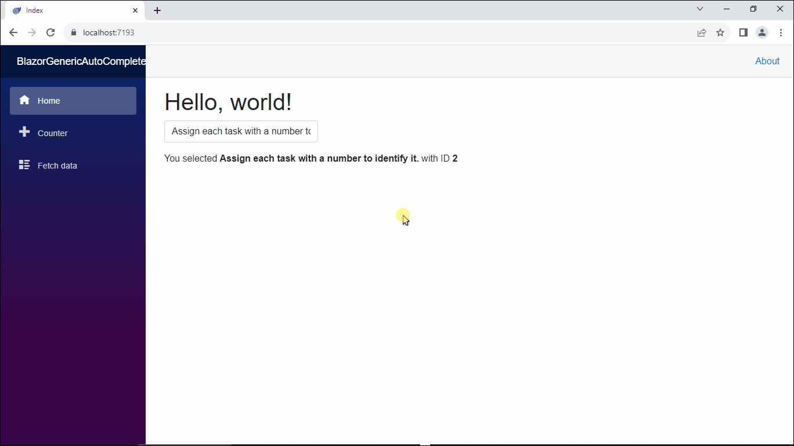

# BlazorGenericAutoComplete



## Steps to use

1. Clone the repo
   ```sh
   git clone https://github.com/potlitel/BlazorGenericAutoComplete
   ```
2. Install json-server NPM package
   ```sh
   npm i json-server
   ```
3. Go to the data folder and run the following command

   ```js
   json-server --watch db.json
   ```

   By executing this command we start a backend server with the data that we will use in our Blazor App.

   You can start JSON Server on other ports with the --port flag:

   ```js
   json-server --watch db.json --port 3004
   ```

4. Finally, run the blazor app.
